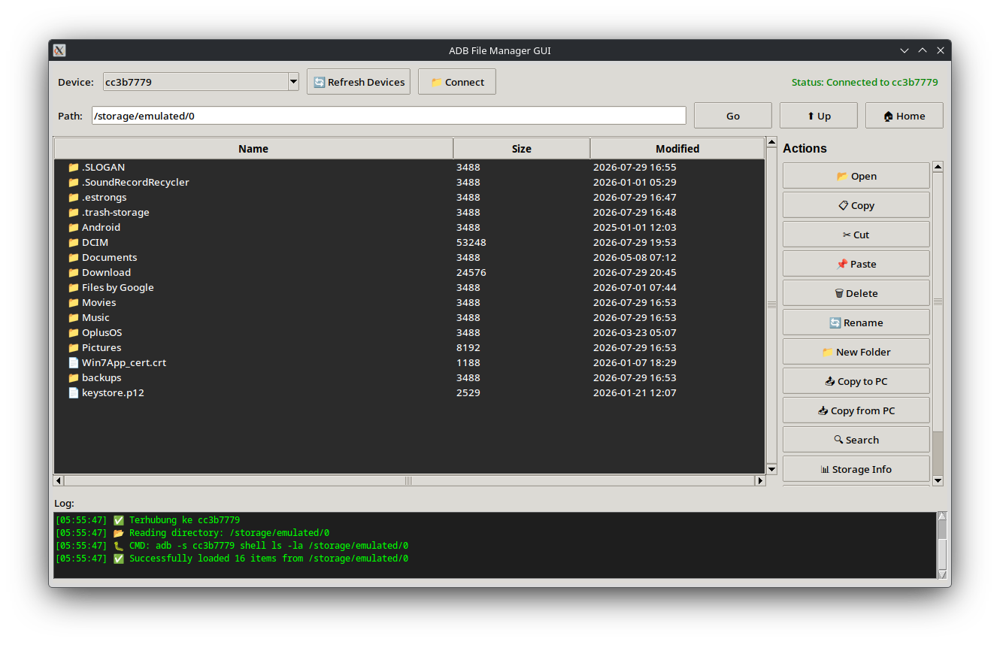

# ADB File Manager



[](LICENSE)

Aplikasi GUI untuk mengelola file di perangkat Android melalui ADB, tanpa perlu root.


## Download

Unduh versi terbaru dari halaman [**Releases**](../../releases/latest):

| Platform | File |
|----------|------|
| 🐧 Linux | `adb-file-manager-linux` |
| 🪟 Windows | `adb-file-manager-windows.exe` |
| 🍎 macOS | `adb-file-manager-macos` |

---

## Persyaratan: Install ADB

Aplikasi ini membutuhkan **ADB (Android Debug Bridge)** yang sudah tersedia di PATH sistem kamu.

### 🐧 Linux

**Ubuntu / Debian / Linux Mint:**
```bash
sudo apt update
sudo apt install adb
```

**Arch Linux / Manjaro:**
```bash
sudo pacman -S android-tools
```

**Fedora / RHEL:**
```bash
sudo dnf install android-tools
```

Verifikasi:
```bash
adb version
```

---

### 🪟 Windows

1. Download **SDK Platform-Tools** dari situs resmi Android:
   👉 https://developer.android.com/tools/releases/platform-tools

2. Ekstrak ZIP ke folder, misalnya: `C:\platform-tools\`

3. Tambahkan ke **PATH**:
   - Buka **Start** → ketik `Environment Variables`
   - Klik **Edit the system environment variables**
   - Klik **Environment Variables** → pilih `Path` → **Edit**
   - Klik **New** → masukkan `C:\platform-tools`
   - Klik OK semua dialog

4. Verifikasi di Command Prompt:
   ```cmd
   adb version
   ```

---

### 🍎 macOS

**Menggunakan Homebrew** (cara termudah):
```bash
brew install --cask android-platform-tools
```

Jika Homebrew belum terinstall:
```bash
/bin/bash -c "$(curl -fsSL https://raw.githubusercontent.com/Homebrew/install/HEAD/install.sh)"
```

Atau download manual:
1. Download dari https://developer.android.com/tools/releases/platform-tools
2. Ekstrak dan tambahkan ke PATH di `~/.zshrc` atau `~/.bash_profile`:
   ```bash
   export PATH="$PATH:/path/to/platform-tools"
   ```

Verifikasi:
```bash
adb version
```

---

## Menjalankan Aplikasi

### Aktifkan USB Debugging di Android
1. Buka **Pengaturan** → **Tentang Ponsel**
2. Ketuk **Nomor Build** 7 kali hingga muncul pesan "Anda adalah developer"
3. Kembali ke **Pengaturan** → **Opsi Developer** → aktifkan **USB Debugging**
4. Hubungkan perangkat ke PC via USB
5. Izinkan koneksi ADB saat muncul dialog di perangkat

### Linux / macOS
```bash
chmod +x adb-file-manager-linux   # atau adb-file-manager-macos
./adb-file-manager-linux
```

### Windows
Klik dua kali `adb-file-manager-windows.exe`

---

## Fitur

- 📂 Browse file & folder di perangkat Android
- 📋 Copy, Cut, Paste file
- 🗑 Hapus file/folder
- 🔄 Rename file/folder
- 📤 Copy file dari Android ke PC
- 📥 Copy file dari PC ke Android (push)
- 🔍 Cari file berdasarkan nama
- 📊 Informasi penyimpanan
- **Sorting** kolom Name / Size / Modified (Ascending / Descending / Default)
- **Transfer progress** real-time untuk push/pull

---

## Menjalankan dari Source

Butuh Python 3.8+:
```bash
python3 "ADB File Manager.py"
```
